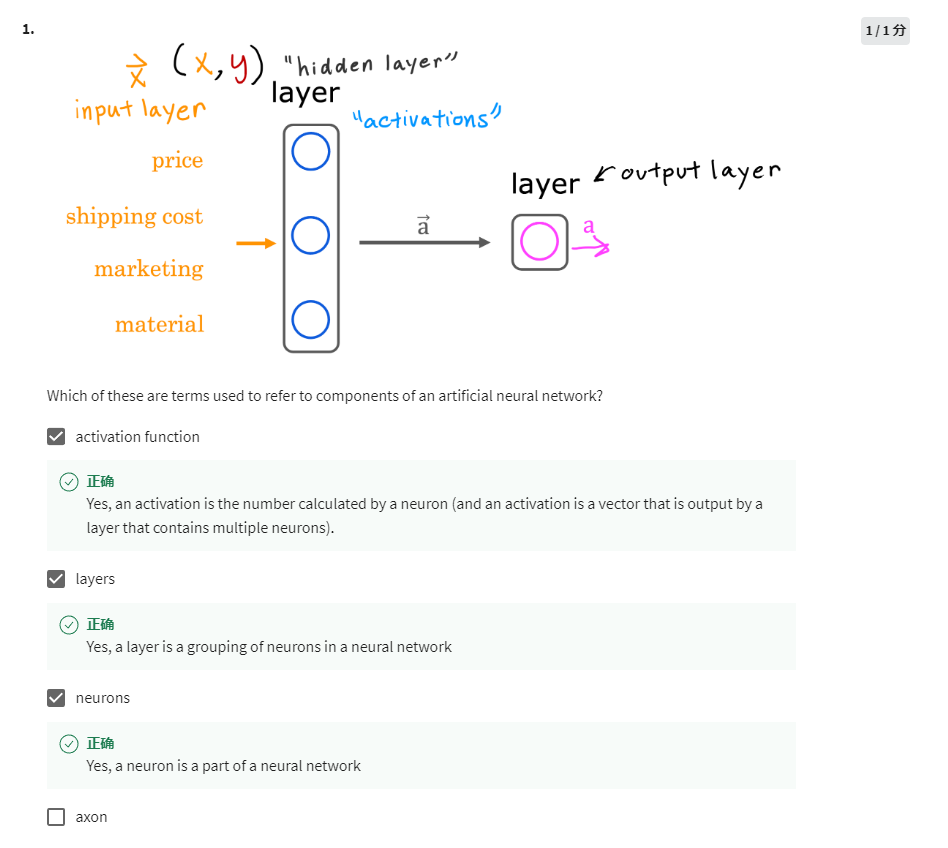
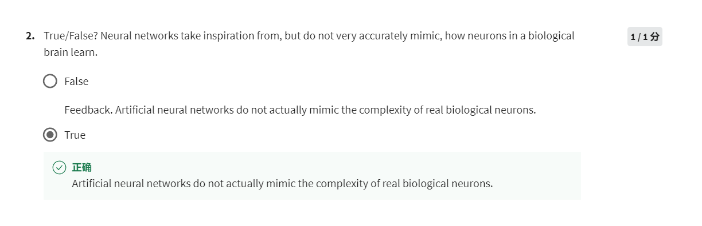

1. The output calculated by a neuron or a layer containing multiple neurons is called activation
2. A group of neurons, which calculate activations together, the group is called layer
3. Neuron is the smallest unit in a neural network

The neural network is a simplified mimic of human brain.