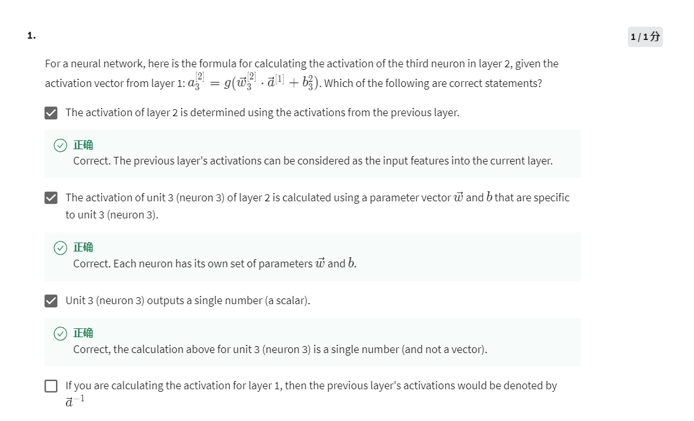
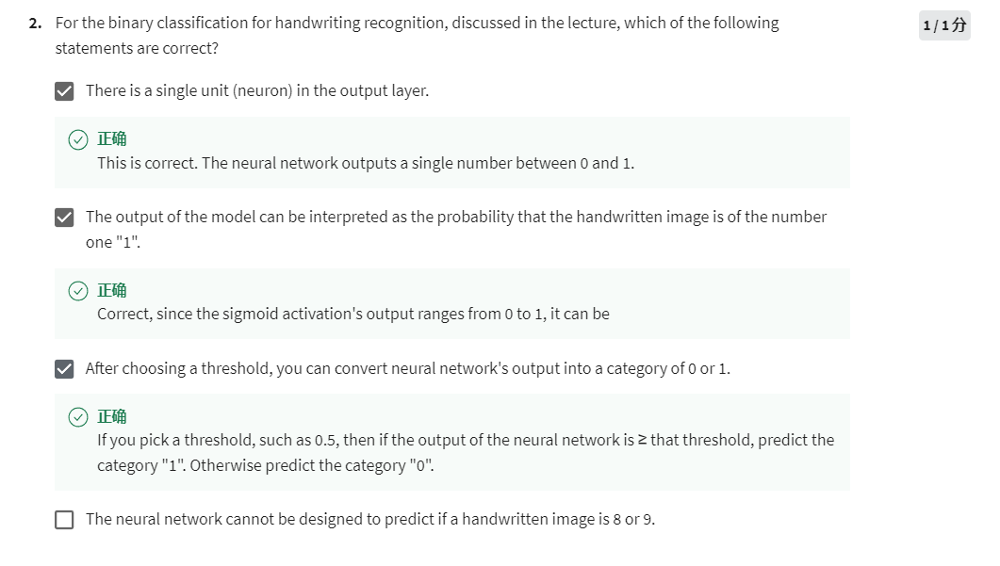
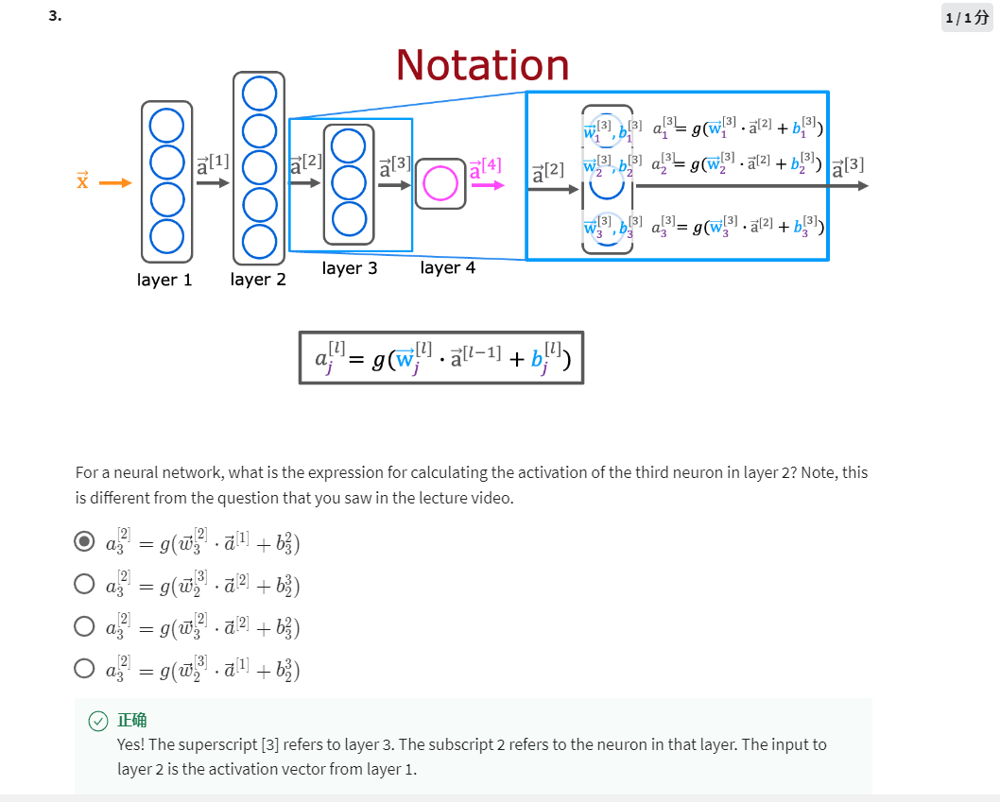
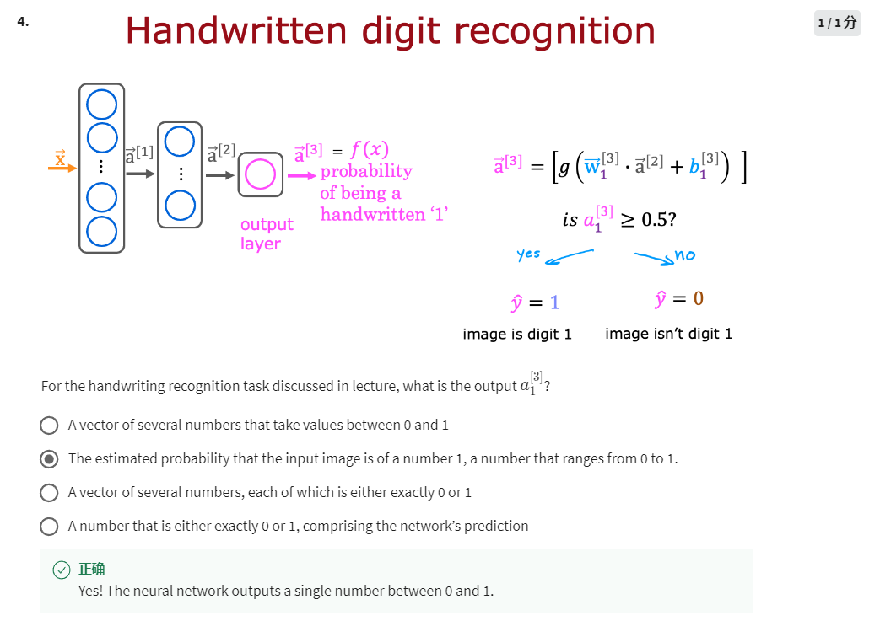

1. The next layer takes the activations from the previous layer as its inputs
2. A neuron will have its own w and b which are both vectors
3. a3 is not a vector
4. Before layer1 is layer0

1. Output layer only has one activation
2. Output layer outputs a scaler value that has range of 0 or 1
3. Output layer outputs a scaler value and can be considered as 0 or 1
4. Wrong

Third neuron means the subscript is 3, layer2 means the superscript is [2], and the input subscript is 1 because its the activation from layer1.

a1[3] is a scaler that estimates if the handwriting image is a "1"
