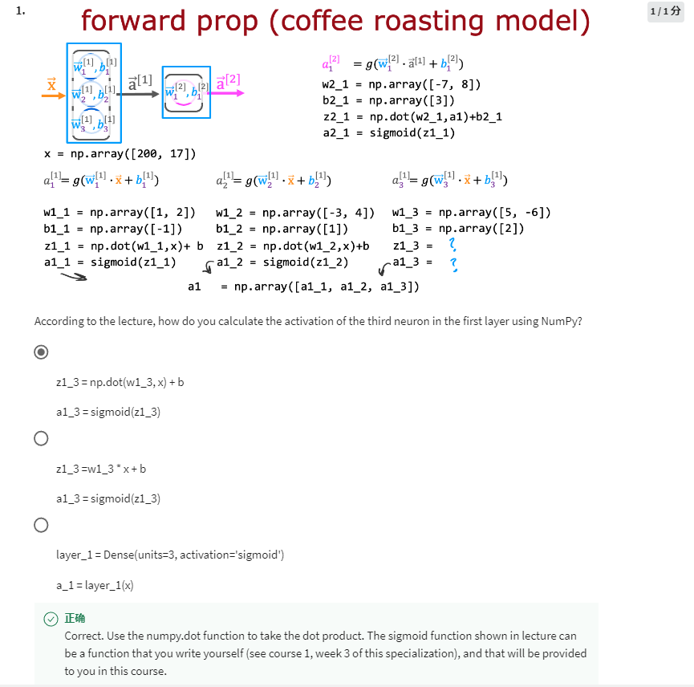
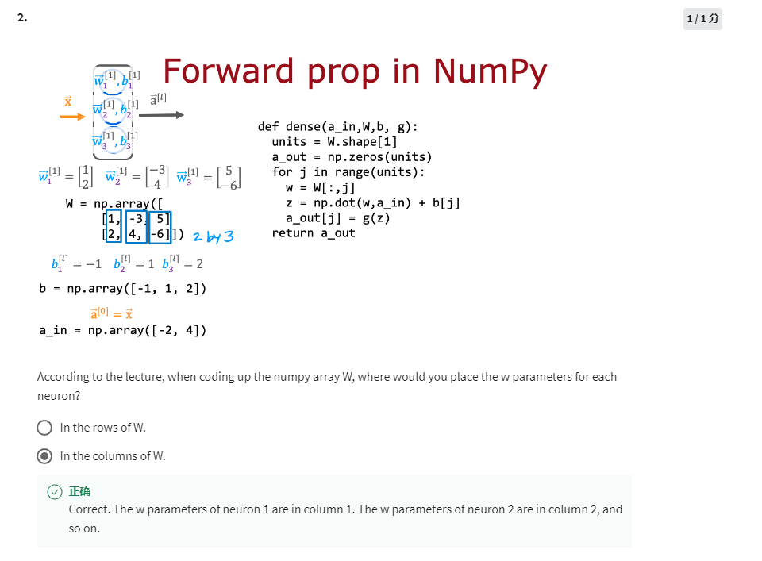
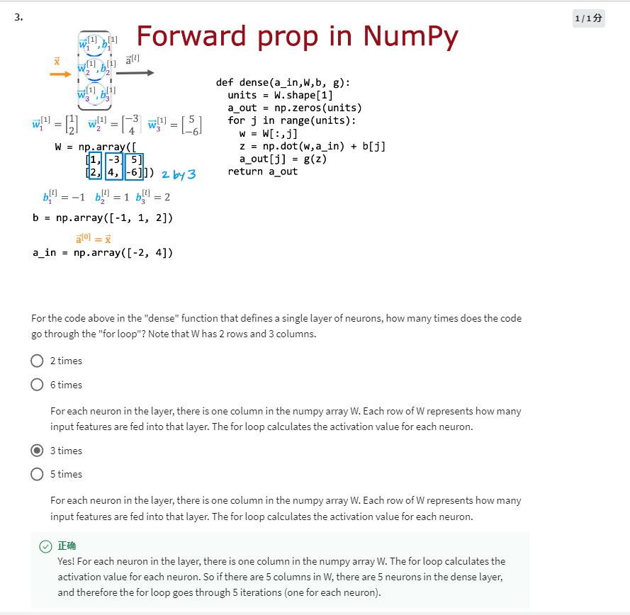

z1_3 = np.dot(w1_3,x) + b

a1_3 = sigmoid(z1_3)

3 neurons with 2 features, at least 6 parameters are required. One neuron should have one column of W to be calculated.

3 times, 1 column each time
