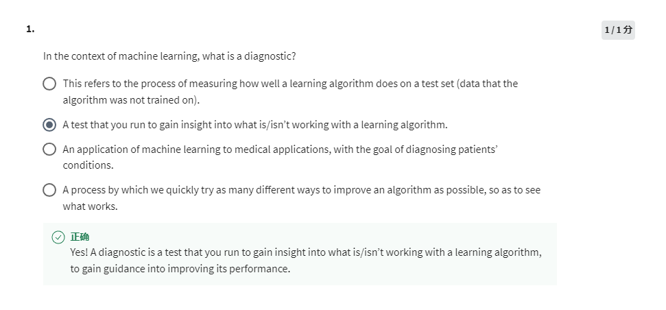
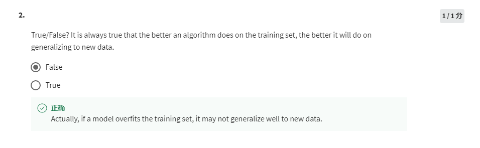
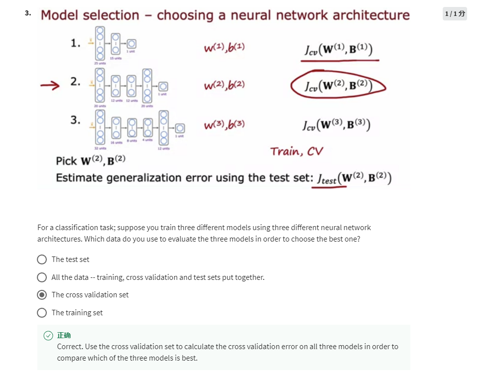

diagnostic is a kind of test applying to the learning algorithm, willing to gain insight and guidance for improving.

False, too good performance on training set is easy to lead an overfitting problem.

Cross validation set (dev set) is used to help us better make decisions on hyper parameters, like the order of polynomial or the regularization lambda. 
