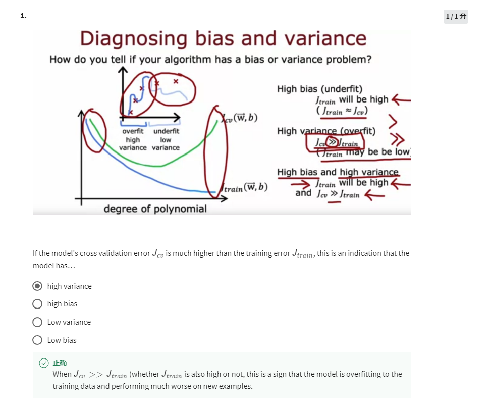
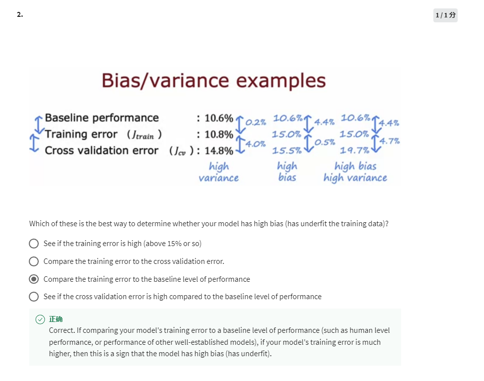
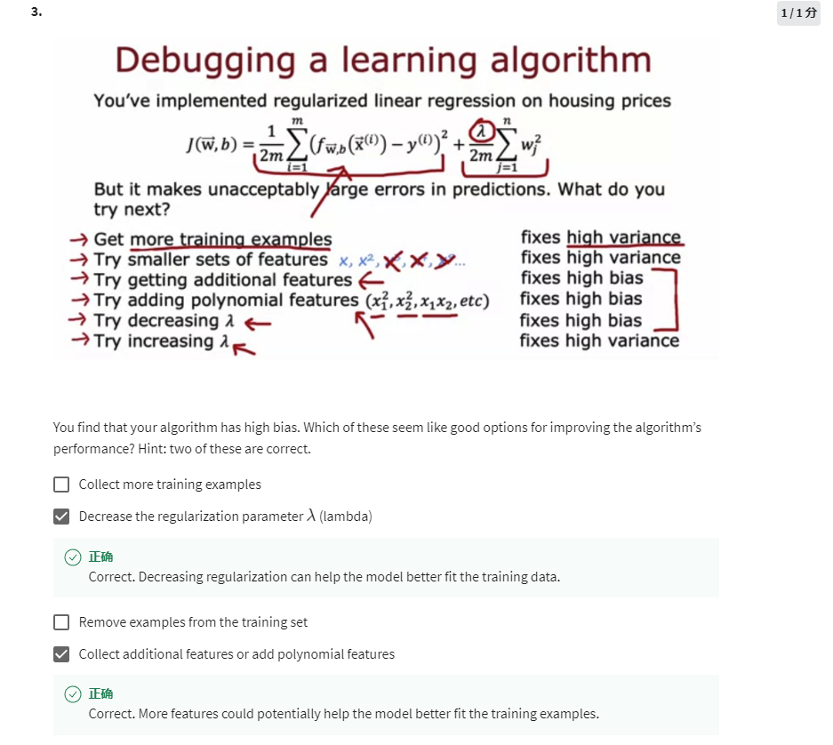
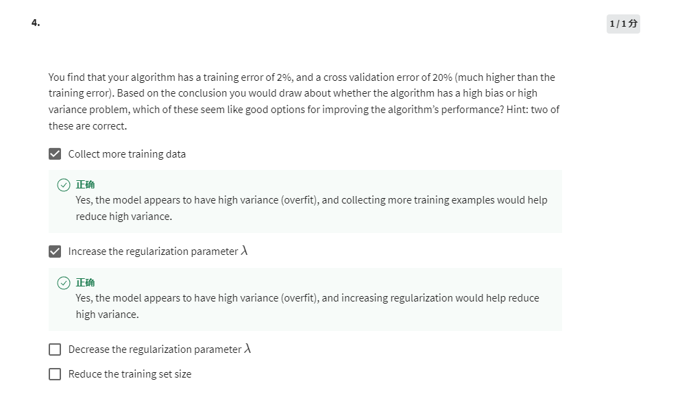

High variance. No matter Jtrain is high or not, as long as Jcv is much greater than Jtrain, there would be high variance problem.

Compare the training error to the baseline performance. If Jtrain is much greater than baseline, it usually indicates the model is of high bias.

1. More examples fixes high variance
2. Decrease lambda fixes high bias
3. Remove examples cannot usually make model better
4. Add additional features fixes high bias

Jcv >> Jtrain means the learning algorithm has the problem of high variance.

1. More training data fixes high variance
2. Increase lambda fixes high variance
3. Decrease lambda fixes high bias
4. Reduce training set size usually contributes nothing to performance improving
