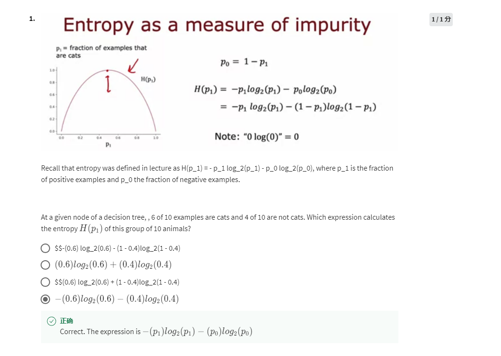
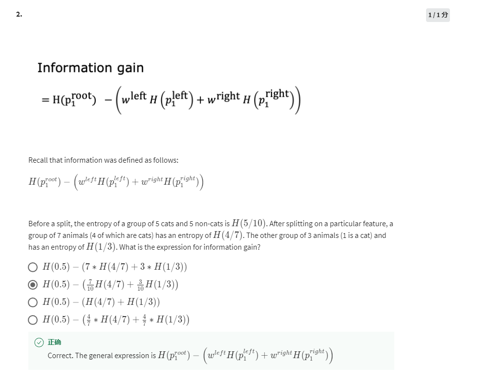
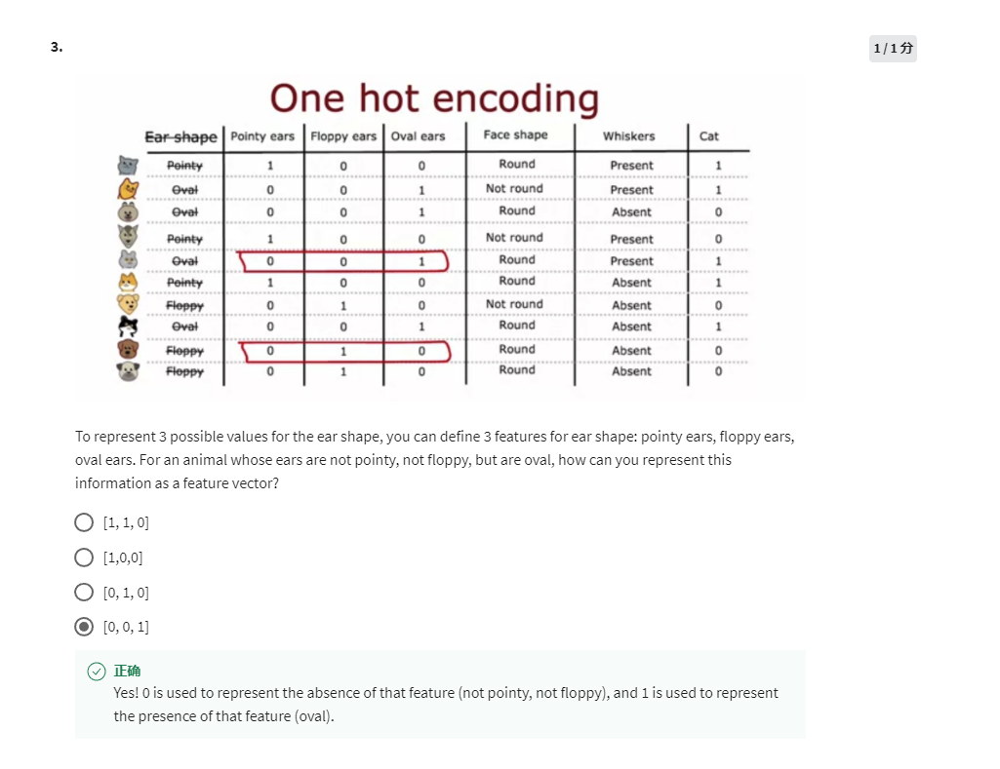
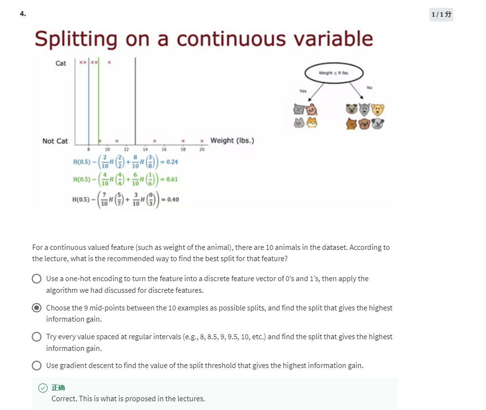
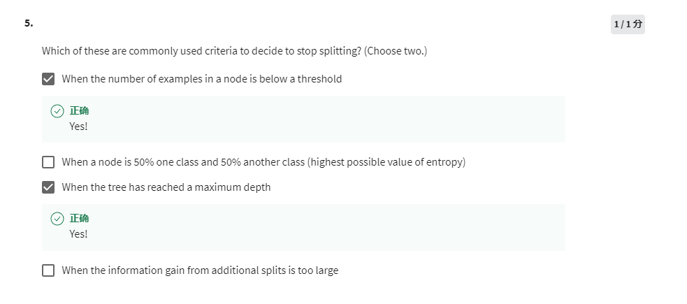

-(p1)log2(p1)-(p0)log2(p0)

p1 = 0.6, p0 = 0.4

H(5/10) - (7/10 x H(4/7) + 3/10 x H(1/3))

(0, 0, 1)

9 mid-points, try to split each one, find the highest information gain.

- Below a threshold
- Max depth
