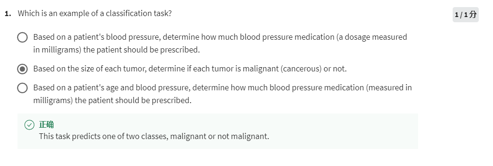
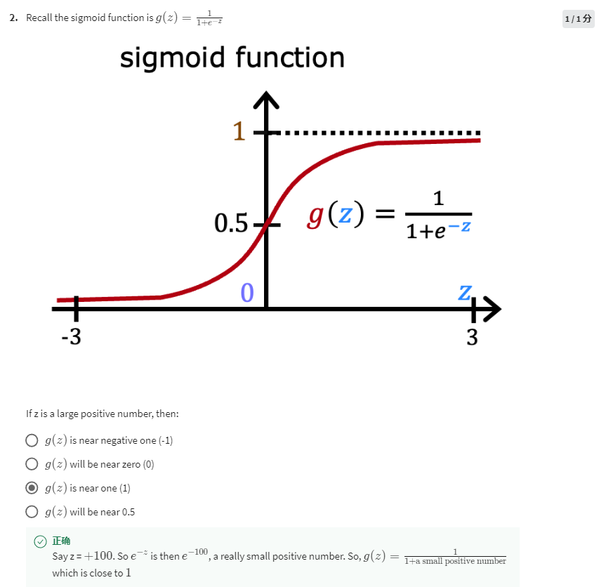
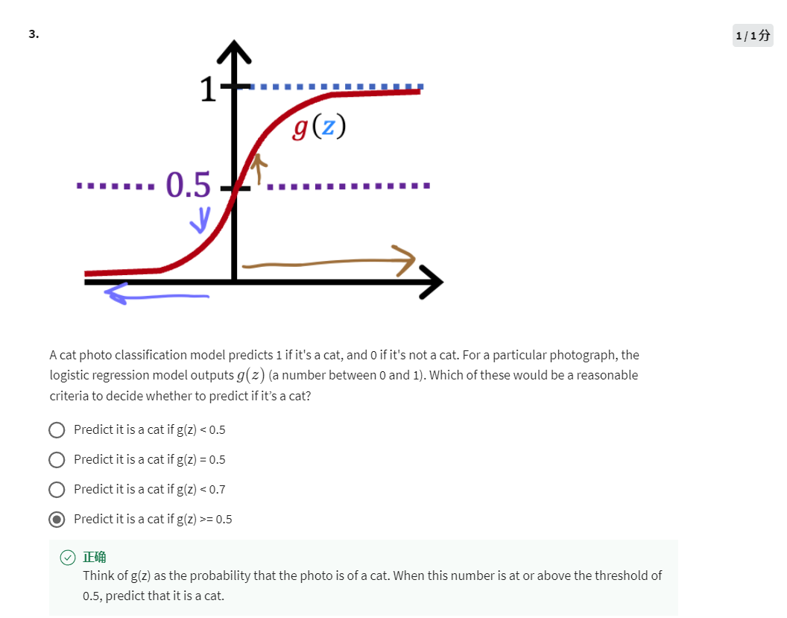
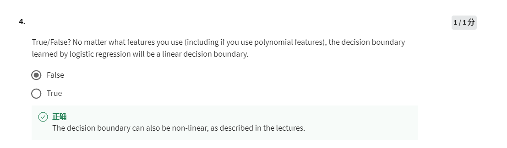

Classification puts prediction into limited groups, Linear Regression predicts numbers.

The bigger z is, the closer g(z) is to 1, the smaller z is, the closer g(z) is to 0. 

g(z) >= 0.5 means the photo is more like a cat.

Not exactly, as per the last examples the boundary are circle and oval.