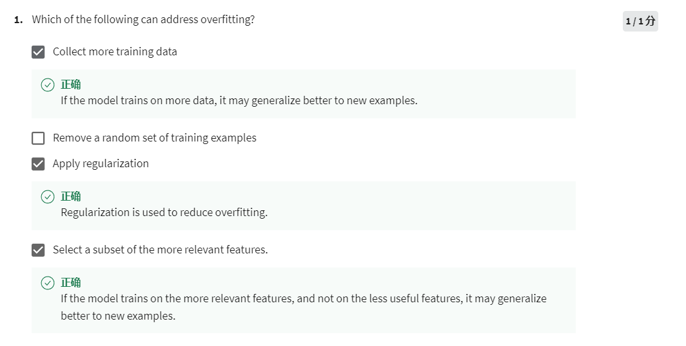
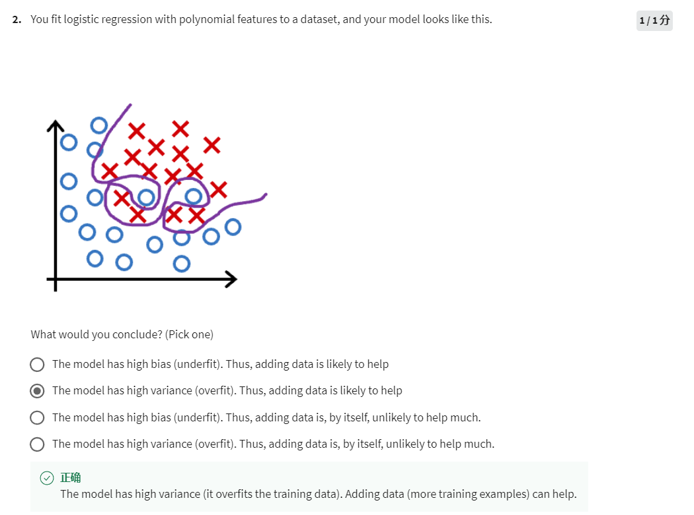
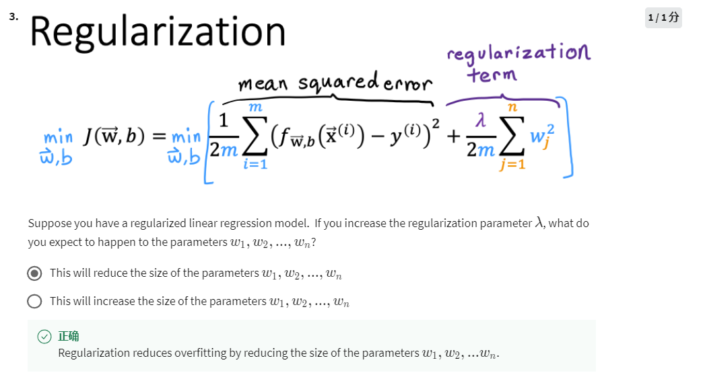

1. More training data, better generalization
2. Regularization reduces the weights of features
3. Subset of features eliminates some irrelevant features 

Typical overfitting, the previous question mentioned 3 mitigation approaches.

The size of w will be reduced so that the model becomes more generalized. 