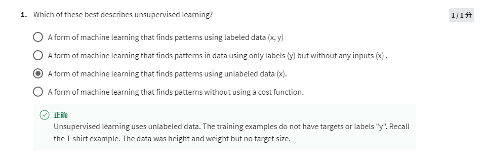
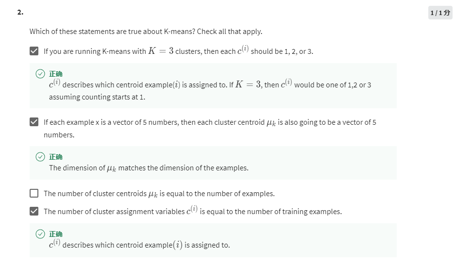
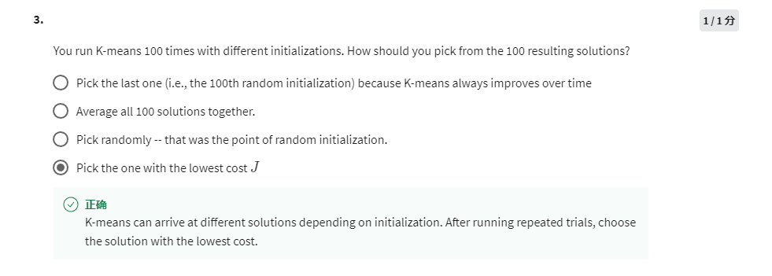
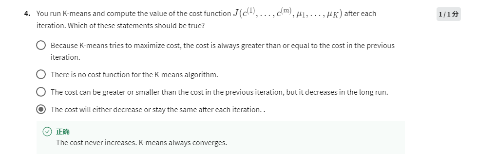
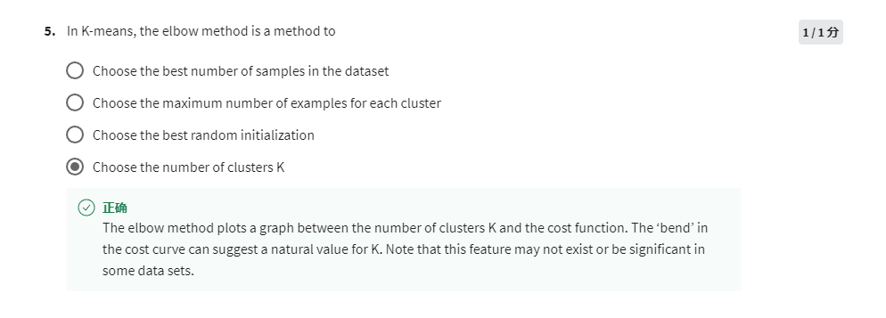

unlabeled data

The value of c(i) is the index of centroid and should be no more than K

μk should be the same numbers of vector as example x.

Each example has a c(i) which contains index to the closest centroid.

Pick the one that has the lowest cost.

Cost function meant to reduce cost.

Choose the number of cluster K.