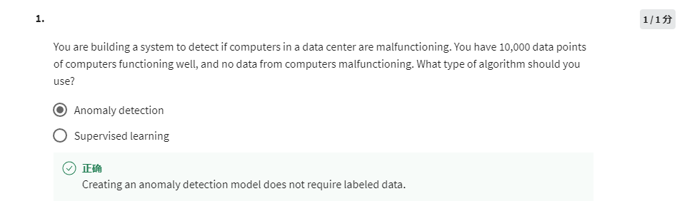
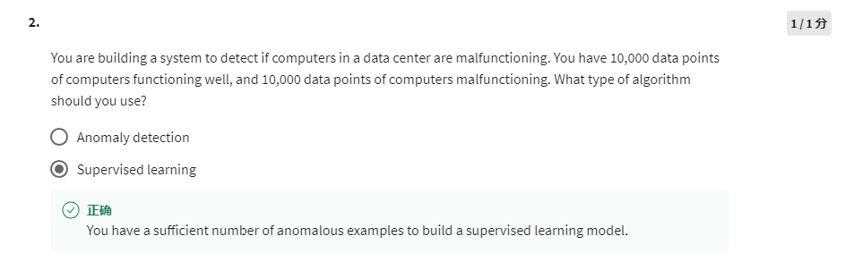
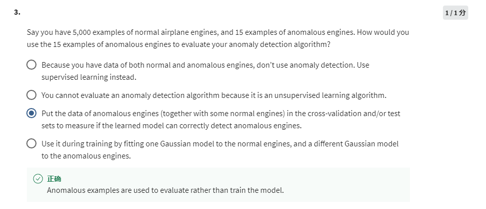
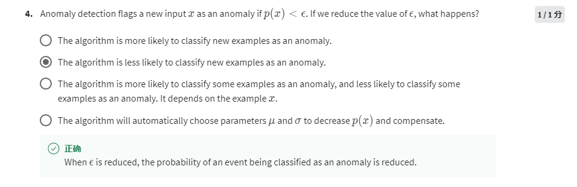
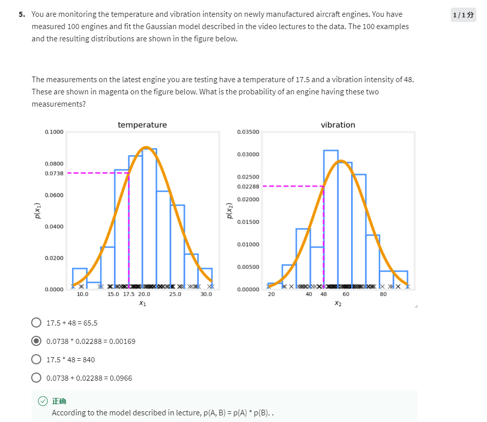

Anomaly detection, because there's no label indicating which data point is malfunctioning.

Supervised learning, as you already have the labeled data sets.

 Create a cross validation set and a test set, to evaluate and optimize the model.

Less likely to consider a new example as anomaly, because smaller epsilon means more tolerant standard.

The probabilities are independent. Just multiple P1*P2.