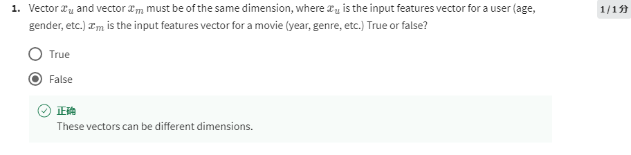
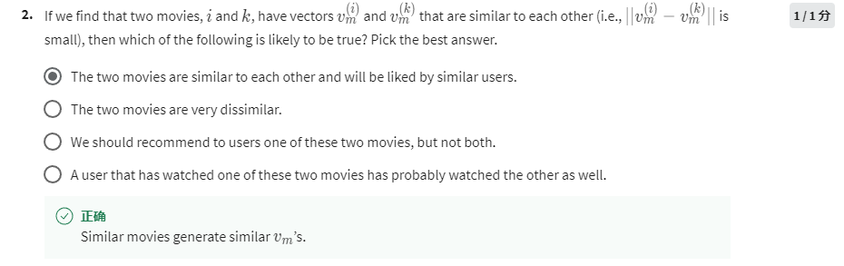
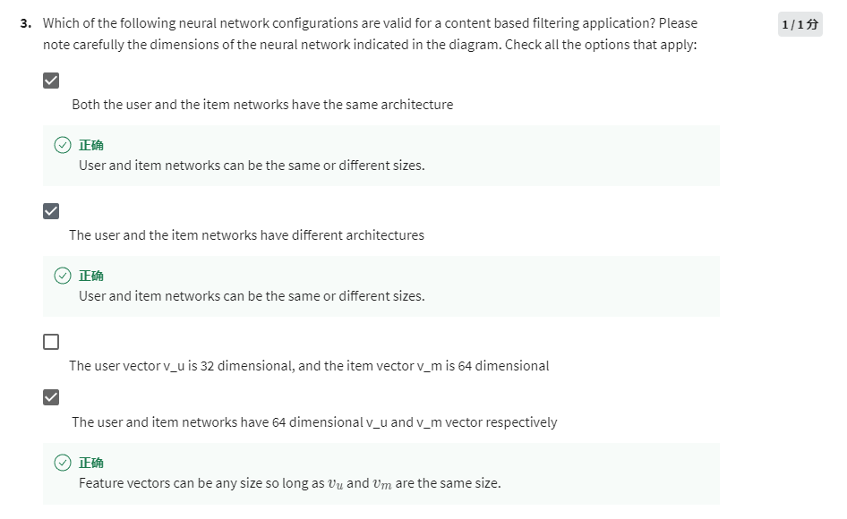
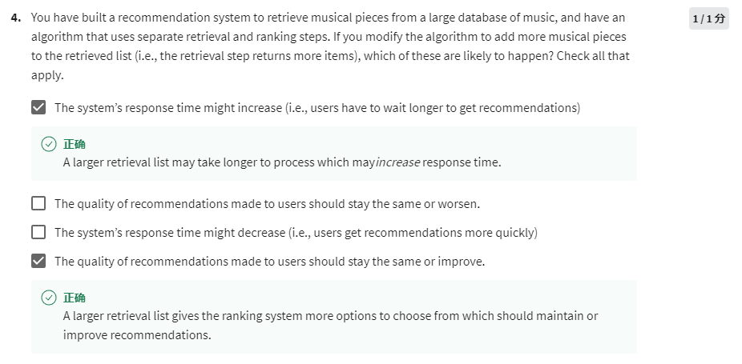
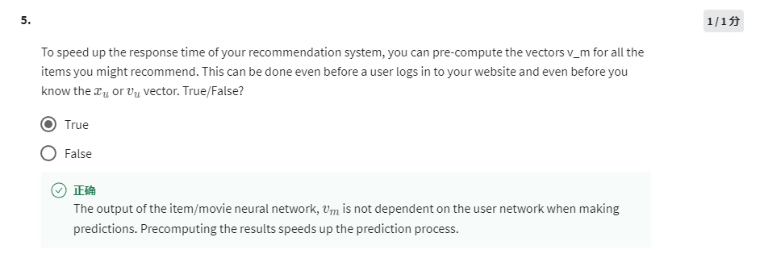

False, there's no limitations for dimensions

The two movies may have similar genre.

The third one isn't the correct one. The Vu and Vm must have the same dimensions because these two will generate the output by dot product.

1. Time consuming increases
2. More items better performance

True, Vm is independent on Vu

