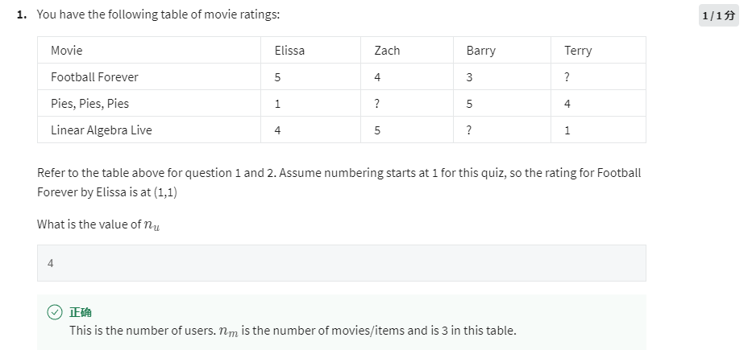
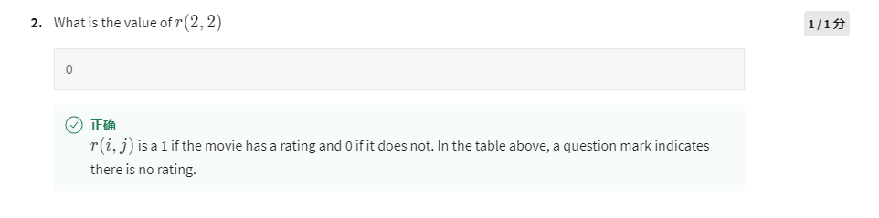
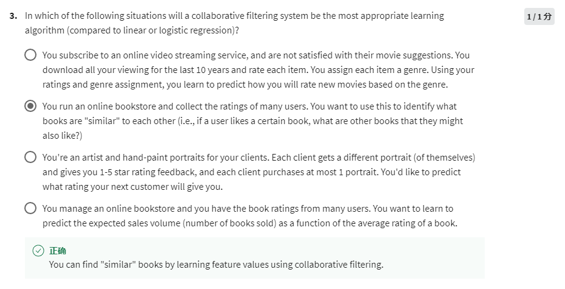
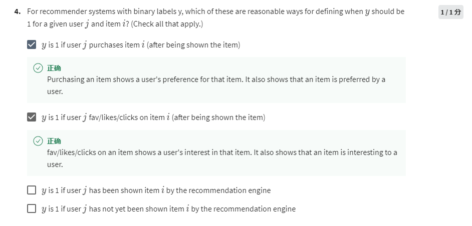

nu is the number of user, which is 4

(2,2) indicates the rating of Pie, Pie, Pie by Zach, which is ?, means zach didn't rate it, r indicates if there's a rating or not, because zach didn't do it, r(2,2) should be 0.

1. Only single user
2. true
3. Only single type of portrait
4. Average rating doesn't need collaborative filtering

1. Purchase is a strong sign
2. Fav/like/click also mean the user was interested in the item
3. Shown but no user response
4. Same to the previous one
