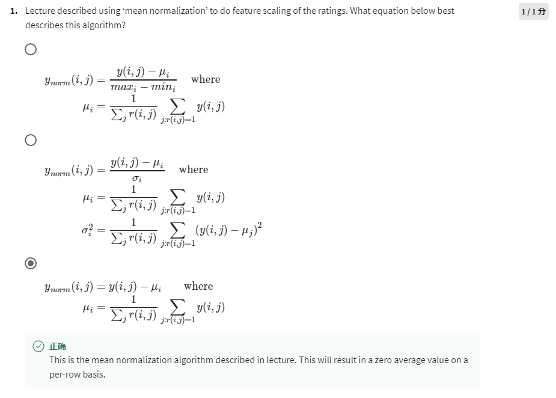
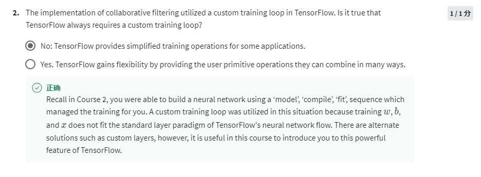
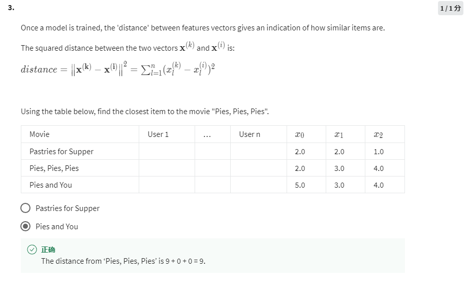
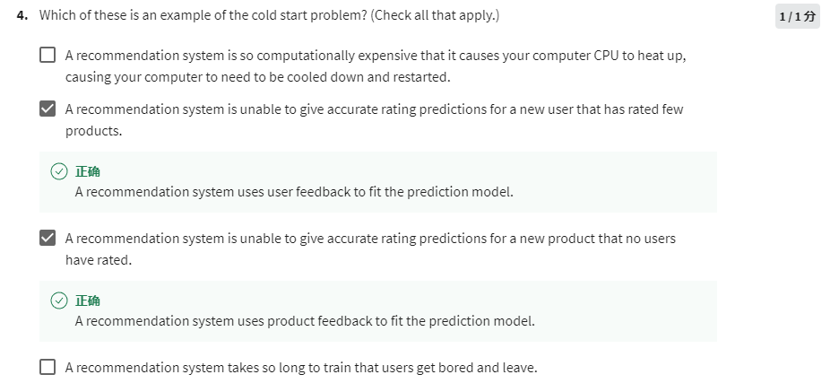

The third one is correct, just minus the mean value by each y.

No, in most cases TensorFlow provides compact methods to simplify the iteration.

Dist of Pie and You = 9

Dist of Pastries for Supper = 11

Both new item that has few ratings and new user who has given few ratings are included in cold start problem.
